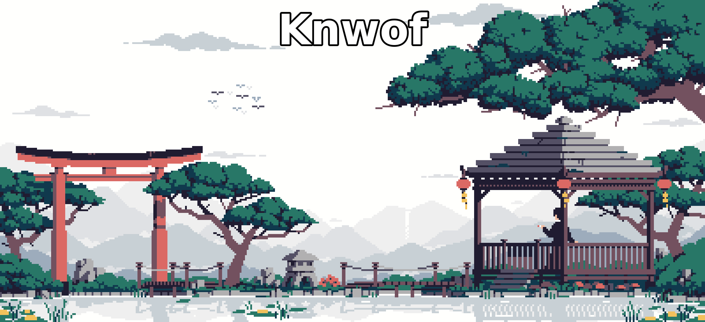

  

# Hello Connections! 🌱

I am Navu, 17-year-old developer building high-performance infrastructure. Academics weren't my strong suit so I took Humanities, but my drive stays fixed on code and building systems.

> [!NOTE]
> Currently developing for **[Biolink](https://fear.rest)**

<h3 align="center">📚 Languages & Tools I Have Placed My Hands On</h3>

   
   
   
  

